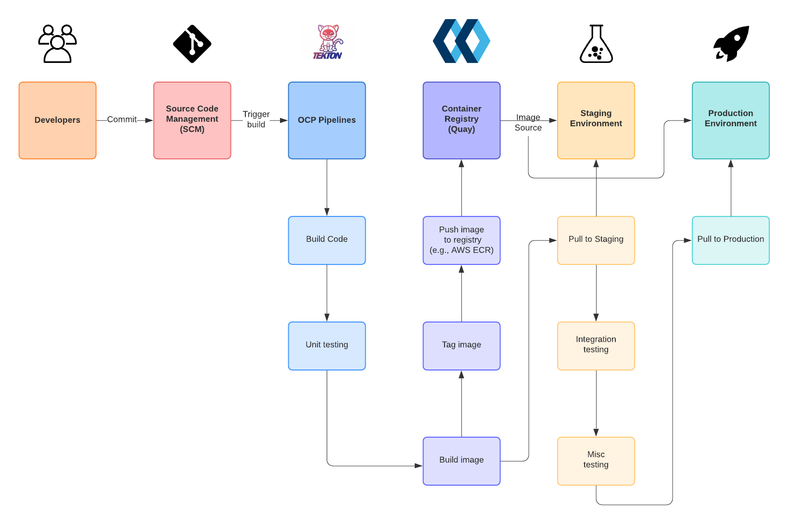

:data-uri:
:toc: left
:markup-in-source: +verbatim,+quotes,+specialcharacters
:source-highlighter: rouge
:icons: font
:stylesdir: stylesheets
:stylesheet: colony.css

= OpenShift Pipelines

OpenShift Pipelines is a cloud-native, continuous integration and continuous delivery (CI/CD) solution based on Kubernetes resources. It uses Tekton building blocks to automate deployments across multiple platforms by abstracting away the underlying implementation details.

.Prerequisites :
. The Tekton Pipelines Operator installed on your OpenShift environment, for more information please refer to https://docs.openshift.com/container-platform/4.4/pipelines/installing-pipelines.html[Installing OpenShift Pipelines]
. The Tekton command-line interface CLI (tkn) is installed on your development environment, for more information please refer to https://docs.openshift.com/container-platform/4.4/cli_reference/tkn_cli/installing-tkn.html[Installing tkn]
. Basic knowledge of Tekton Pipelines, for more information please refer to
.. https://github.com/tektoncd/pipeline/tree/master/docs[]
.. https://docs.openshift.com/container-platform/4.4/pipelines/understanding-openshift-pipelines.html[]

:sectnums:

== What I'm trying to do in this demo
Implementation of a Typical Continuous Integration and Continuous Delivery (CI/CD) process using the Tekton pipeline.

. Source code is retrieved from a source code management tool which is then compiled and packaged into an artifact.
. The artifact is packaged into a container image through the execution of the Source-To-Image build process.
. Once complete, the resulting image is scanned for vulnerabilities. The end user is provided the ability to review the results of the scan and decide whether to continue or abort the pipeline. If approved, the image is signed using the tools previously configured in the environment and then is ultimately deployed.

== Concepts
2- by default there are a good list of built in clustertasks that you can use

[source,bash]
----
$ tkn clustertask list
NAME                       DESCRIPTION   AGE
buildah                                  7 hours ago
buildah-v0-11-3                          7 hours ago
git-clone                                7 hours ago
jib-maven                                7 hours ago
kn                                       7 hours ago
maven                                    7 hours ago
openshift-client                         7 hours ago
openshift-client-v0-11-3                 7 hours ago
s2i                                      7 hours ago
s2i-dotnet-3                             7 hours ago
s2i-dotnet-3-v0-11-3                     7 hours ago
s2i-go                                   7 hours ago
s2i-go-v0-11-3                           7 hours ago
s2i-java-11                              7 hours ago
s2i-java-11-v0-11-3                      7 hours ago
s2i-java-8                               7 hours ago
s2i-java-8-v0-11-3                       7 hours ago
s2i-nodejs                               7 hours ago
s2i-nodejs-v0-11-3                       7 hours ago
s2i-perl                                 7 hours ago
s2i-perl-v0-11-3                         7 hours ago
s2i-php                                  7 hours ago
s2i-php-v0-11-3                          7 hours ago
s2i-python-3                             7 hours ago
s2i-python-3-v0-11-3                     7 hours ago
s2i-ruby                                 7 hours ago
s2i-ruby-v0-11-3                         7 hours ago
s2i-v0-11-3                              7 hours ago
tkn                                      7 hours ago
----

[source,bash]
----
$ tkn clustertask describe maven
----
https://github.com/tektoncd/catalog/tree/master/github

[source,bash]
----
$ tkn pipeline create -f mypipeline.yaml -n myspace

$ tkn pipeline logs -f mypipeline
----

== Future Plans (WIP)
. Image scan for vulnerabilities using Clair.
. Blue/Green Deployment example
. Image signature
