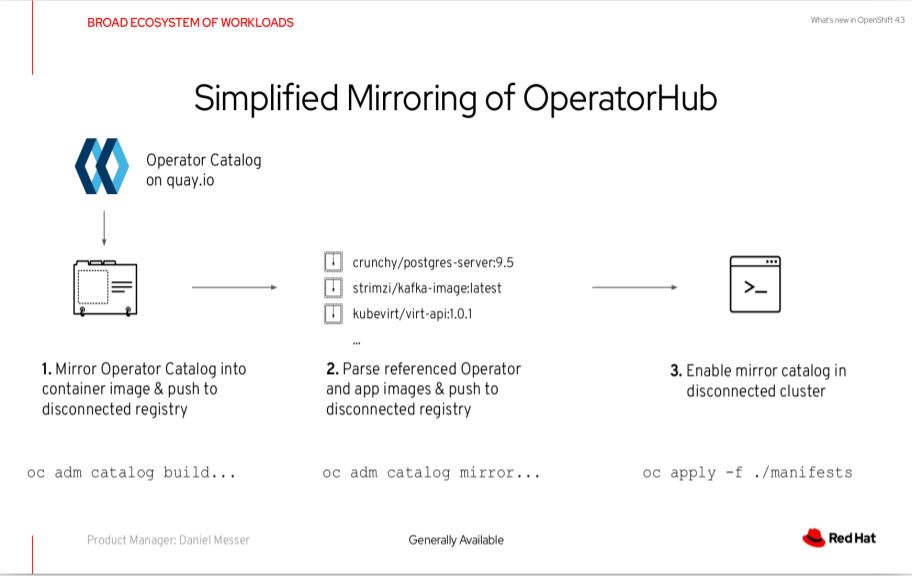

= Disable Internet access

== Rational:
** The desire to have
*** Controlled communication with external (internet) sources

== Impact :
To understand why internet access is required, i will list down the needed internet sources and impact of disabling each of them

=== Access RedHat registry for downloading installation images

OpenShift ships images from https://quay.io[] and mirrors
these images to the https://access.redhat.com/containers/[Red Hat Container Catalog]

==== Impact of Disabling
A local mirror of images is needed, and additional configuration to enable disconnected installation

===  Access RedHat catalog for Operators

The OperatorHub is available via the OpenShift Container Platform
web console and is the interface that cluster administrators use to discover and install Operators.
Currently, https://quay.io[] is the external data store used by the OperatorHub

==== Impact of Disabling: 

Cluster administrators needs to create local mirrors so that OLM can install and manage Operators from the local sources instead.
for more info, please refer https://access.redhat.com/articles/4740011[Red Hat Operators Supported in Disconnected Mode]

===  Access to RedHat Remote health reporting https://cloud.redhat.com[] 

==== Impact of Disabling:

* Red Hat will not be able to monitor the success of product upgrades or the health of your clusters without a support case being opened.
* Red Hat will not be able to use anonymized configuration data to better triage customer support cases and identify which configurations our customers find important.
* The Red Hat OpenShift Cluster Manager will not show data about your clusters including health and usage information.
* Your subscription entitlement information must be manually entered via cloud.redhat.com without the benefit of automatic usage reporting.
+
[IMPORTANT]
====
Red Hat strongly recommends leaving health and usage reporting enabled for pre-production and test clusters even if it is necessary to opt out for production clusters. This allows Red Hat to be a participant in qualifying OpenShift Container Platform in your environments and react more rapidly to product issues.

====

=== Access to OpenShift cluster management information like update information https://api.openshift.com[]

==== Impact of Disabling 
you don’t have an upgrade graph like you would for a connected cluster

IMPORTANT: In case of connected environment, firewall can be used to whitelist communication.
for more info, please refer to https://docs.openshift.com/container-platform/4.2/installing/install_config/configuring-firewall.html[Configuring your firewall]

